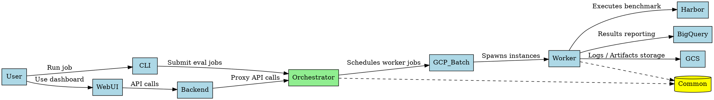
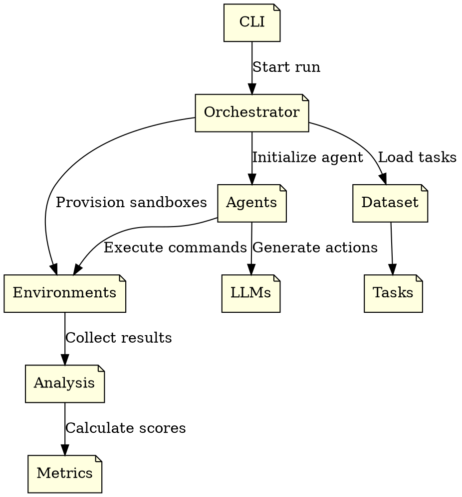
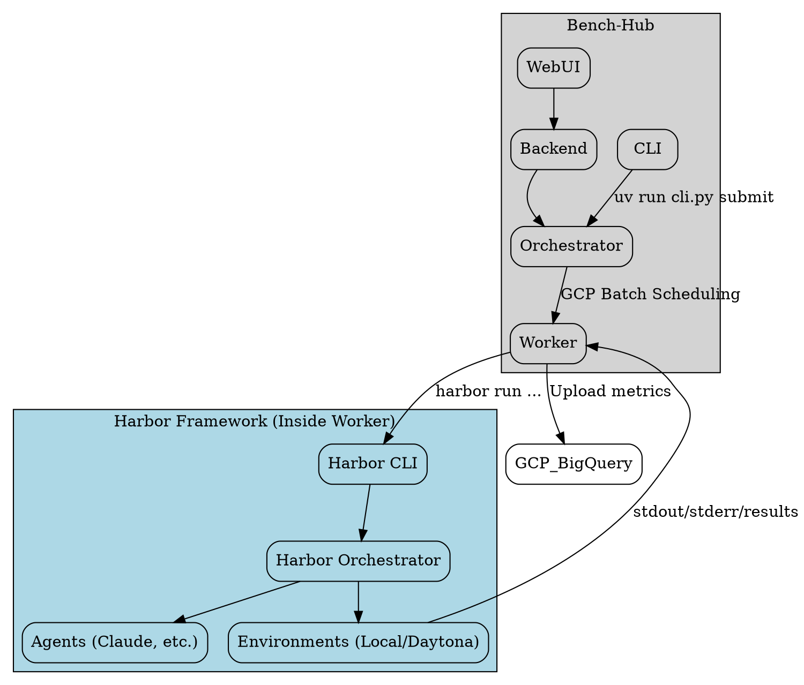

# BenchHub and Harbor Analysis

## 1. BenchHub

### How to set up and run locally
**Prerequisites:**
- `uv` installed for dependency management.
- Google Cloud SDK installed and configured (`gcloud auth login`, `gcloud auth application-default login`).
- GCP project set (e.g., `ai-incubation-team`).

**Local Setup:**
```bash
# Sync dependencies across components
cd projects/bench-hub
uv sync
```

**Running Components Locally:**
1. **Orchestrator:**
```bash
cd orchestrator
uv sync
uv run uvicorn main:app --reload --port 8080
```
2. **CLI (Submit Job):**
In a new terminal:
```bash
export ORCHESTRATOR_URL="http://localhost:8080"
uv run cli/cli.py submit -d swebench-verified@1.0 --model google/gemini-3-pro-preview
```
3. **Web-UI/Backend:**
Typically involves running Next.js web frontend and FastAPI backend (proxy to Orchestrator).
```bash
cd backend
uv sync
uv run uvicorn main:app --reload --port 8000
```

### Architecture Review
BenchHub consists of:
- **CLI (`cli/`)**: Python client to submit evaluation jobs.
- **Orchestrator (`orchestrator/`)**: Cloud Run FastAPI service managing schedules and BQ reporting.
- **Worker (`worker/`)**: Dockerized Docker environment optimized for Google Cloud Batch that executes Harbor tasks.
- **Common (`common/`)**: Shared types, BigQuery helpers.
- **Backend / Web UI (`backend/`, `web-ui/`)**: User interfaces and proxies for tracking runs visually.

**[Graphviz Architecture Link](https://dreampuf.github.io/GraphvizOnline/#digraph%20benchhub%20%7B%0A%20%20%20%20rankdir%3DLR%3B%0A%20%20%20%20node%20%5Bshape%3Dbox%2C%20style%3Dfilled%2C%20fillcolor%3Dlightblue%5D%3B%0A%20%20%20%20%0A%20%20%20%20User%20-%3E%20CLI%20%5Blabel%3D%22Run%20job%22%5D%3B%0A%20%20%20%20User%20-%3E%20WebUI%20%5Blabel%3D%22Use%20dashboard%22%5D%3B%0A%20%20%20%20WebUI%20-%3E%20Backend%20%5Blabel%3D%22API%20calls%22%5D%3B%0A%20%20%20%20CLI%20-%3E%20Orchestrator%20%5Blabel%3D%22Submit%20eval%20jobs%22%5D%3B%0A%20%20%20%20Backend%20-%3E%20Orchestrator%20%5Blabel%3D%22Proxy%20API%20calls%22%5D%3B%0A%20%20%20%20%0A%20%20%20%20Orchestrator%20%5Bfillcolor%3Dlightgreen%5D%3B%0A%20%20%20%20Orchestrator%20-%3E%20GCP_Batch%20%5Blabel%3D%22Schedules%20worker%20jobs%22%5D%3B%0A%20%20%20%20GCP_Batch%20-%3E%20Worker%20%5Blabel%3D%22Spawns%20instances%22%5D%3B%0A%20%20%20%20%0A%20%20%20%20Worker%20-%3E%20Harbor%20%5Blabel%3D%22Executes%20benchmark%22%5D%3B%0A%20%20%20%20Worker%20-%3E%20BigQuery%20%5Blabel%3D%22Results%20reporting%22%5D%3B%0A%20%20%20%20Worker%20-%3E%20GCS%20%5Blabel%3D%22Logs%20/%20Artifacts%20storage%22%5D%3B%0A%20%20%20%20%0A%20%20%20%20Common%20%5Bshape%3Dcylinder%2C%20fillcolor%3Dyellow%5D%3B%0A%20%20%20%20Worker%20-%3E%20Common%20%5Bstyle%3Ddashed%5D%3B%0A%20%20%20%20Orchestrator%20-%3E%20Common%20%5Bstyle%3Ddashed%5D%3B%0A%7D)**


### Execution Details
- **Manual Steps:**
  1. `gcloud auth login`
  2. `gcloud auth application-default login`
  3. Start orchestrator server locally or configure remote `ORCHESTRATOR_URL`.
  4. Run CLI commands (`uv run cli.py submit ...`).
- **Credentials Required:**
  - Google Cloud credentials for GCP Batch, Vertex AI and BigQuery capabilities.
  - OIDC Tokens for Orchestrator IAM / Cloud Run access.
- **Blockers:**
  - Service Account permission issues (Requires Cloud Run Invoker role).
  - Workstation overriding `application-default` credentials.
  - Missing proper Docker/environment configurations if running worker instances locally without cloud batch.

---

## 2. Harbor

### How to set up and run locally
**Installation:**
```bash
uv tool install harbor
# or
pip install harbor
```

**Running Locally:**
```bash
export ANTHROPIC_API_KEY=<YOUR-KEY>
harbor run --dataset terminal-bench@2.0    --agent claude-code    --model anthropic/claude-opus-4-1    --n-concurrent 4 
```
*Note: Uses Docker locally by default to launch evaluation sandboxes.*

### Architecture Review
Harbor is a standalone evaluation framework composed of:
- **CLI (`cli/`)**: Command line wrapper for kicking off evaluations.
- **Orchestrators (`orchestrators/`)**: Controls the campaign and matches tasks to environments.
- **Agents (`agents/`)**: Wrappers for Claude Code, OpenHands, Codex CLI, etc.
- **Environments (`environments/`)**: Sandbox management layer (Docker, Daytona, Modal).
- **Datasets & Tasks (`dataset/`, `tasks/`)**: Definitions and configurations for benchmarks like SWE-bench.
- **Models & LLMs (`models/`, `llms/`)**: Interaction with Anthropic/Google/OpenAI APIs.

**[Graphviz Architecture Link](https://dreampuf.github.io/GraphvizOnline/#digraph%20harbor%20%7B%0A%20%20%20%20rankdir%3DTB%3B%0A%20%20%20%20node%20%5Bshape%3Dnote%2C%20style%3Dfilled%2C%20fillcolor%3Dlightyellow%5D%3B%0A%20%20%20%20%0A%20%20%20%20CLI%20-%3E%20Orchestrator%20%5Blabel%3D%22Start%20run%22%5D%3B%0A%20%20%20%20Orchestrator%20-%3E%20Environments%20%5Blabel%3D%22Provision%20sandboxes%22%5D%3B%0A%20%20%20%20Orchestrator%20-%3E%20Agents%20%5Blabel%3D%22Initialize%20agent%22%5D%3B%0A%20%20%20%20Orchestrator%20-%3E%20Dataset%20%5Blabel%3D%22Load%20tasks%22%5D%3B%0A%20%20%20%20%0A%20%20%20%20Dataset%20-%3E%20Tasks%3B%0A%20%20%20%20Agents%20-%3E%20LLMs%20%5Blabel%3D%22Generate%20actions%22%5D%3B%0A%20%20%20%20Agents%20-%3E%20Environments%20%5Blabel%3D%22Execute%20commands%22%5D%3B%0A%20%20%20%20%0A%20%20%20%20Environments%20-%3E%20Analysis%20%5Blabel%3D%22Collect%20results%22%5D%3B%0A%20%20%20%20Analysis%20-%3E%20Metrics%20%5Blabel%3D%22Calculate%20scores%22%5D%3B%0A%7D)**


### Execution Details
- **Manual Steps:**
  1. Install harbor via `uv tool install harbor`.
  2. Set up necessary API keys for LLMs.
  3. Run `harbor run` with dataset, agent, and model inputs.
- **Credentials Required:**
  - LLM provider API keys (e.g., `ANTHROPIC_API_KEY`, `GEMINI_API_KEY`).
  - Cloud sandbox provider API keys if not using local Docker (e.g., `DAYTONA_API_KEY`).
- **Blockers:**
  - Missing API keys.
  - Docker daemon not running (for local environments).
  - Lack of credits / limits reached on cloud environment providers.

---

## 3. BenchHub and Harbor Interaction

### How they interact
BenchHub utilizes Harbor as its core evaluation engine. While BenchHub is concerned with infrastructure, orchestration (GCP Batch scheduling), auth, and UI dashboards, Harbor abstracts the complexities of the evaluation benchmark run itself.

1. Bench-Hub's orchestrator assigns tasks down to cloud worker nodes.
2. The `worker` container installs or runs `harbor`.
3. Harbor manages setting up the agent (e.g., Gemini CLI) and the sandbox (e.g., Docker/Daytona) within the context of that worker.
4. Harbor executes the evaluation task and collects standard metrics.
5. The `worker` script takes Harbor's output and transforms/uploads it to GCP BigQuery and Cloud Storage for BenchHub's WebUI to display.

**[Graphviz Interaction Architecture Link](https://dreampuf.github.io/GraphvizOnline/#digraph%20interaction%20%7B%0A%20%20%20%20rankdir%3DTB%3B%0A%20%20%20%20node%20%5Bshape%3Dbox%2C%20style%3Drounded%2C%20fillcolor%3Dwhite%5D%3B%0A%20%20%20%20%0A%20%20%20%20subgraph%20cluster_benchhub%20%7B%0A%20%20%20%20%20%20%20%20label%3D%22Bench-Hub%22%3B%0A%20%20%20%20%20%20%20%20style%3Dfilled%3B%0A%20%20%20%20%20%20%20%20fillcolor%3Dlightgrey%3B%0A%20%20%20%20%20%20%20%20%0A%20%20%20%20%20%20%20%20CLI%3B%0A%20%20%20%20%20%20%20%20WebUI%3B%0A%20%20%20%20%20%20%20%20Backend%3B%0A%20%20%20%20%20%20%20%20Orchestrator%3B%0A%20%20%20%20%20%20%20%20Worker%3B%0A%20%20%20%20%7D%0A%20%20%20%20%0A%20%20%20%20subgraph%20cluster_harbor%20%7B%0A%20%20%20%20%20%20%20%20label%3D%22Harbor%20Framework%20%28Inside%20Worker%29%22%3B%0A%20%20%20%20%20%20%20%20style%3Dfilled%3B%0A%20%20%20%20%20%20%20%20fillcolor%3Dlightblue%3B%0A%20%20%20%20%20%20%20%20%0A%20%20%20%20%20%20%20%20HarborCLI%20%5Blabel%3D%22Harbor%20CLI%22%5D%3B%0A%20%20%20%20%20%20%20%20HarborOrchestrator%20%5Blabel%3D%22Harbor%20Orchestrator%22%5D%3B%0A%20%20%20%20%20%20%20%20HarborAgents%20%5Blabel%3D%22Agents%20%28Claude%2C%20etc.%29%22%5D%3B%0A%20%20%20%20%20%20%20%20HarborEnvs%20%5Blabel%3D%22Environments%20%28Local/Daytona%29%22%5D%3B%0A%20%20%20%20%7D%0A%20%20%20%20%0A%20%20%20%20CLI%20-%3E%20Orchestrator%20%5Blabel%3D%22uv%20run%20cli.py%20submit%22%5D%3B%0A%20%20%20%20WebUI%20-%3E%20Backend%20-%3E%20Orchestrator%3B%0A%20%20%20%20Orchestrator%20-%3E%20Worker%20%5Blabel%3D%22GCP%20Batch%20Scheduling%22%5D%3B%0A%20%20%20%20%0A%20%20%20%20Worker%20-%3E%20HarborCLI%20%5Blabel%3D%22harbor%20run%20...%22%5D%3B%0A%20%20%20%20HarborCLI%20-%3E%20HarborOrchestrator%3B%0A%20%20%20%20HarborOrchestrator%20-%3E%20HarborAgents%3B%0A%20%20%20%20HarborOrchestrator%20-%3E%20HarborEnvs%3B%0A%20%20%20%20%0A%20%20%20%20HarborEnvs%20-%3E%20Worker%20%5Blabel%3D%22stdout/stderr/results%22%5D%3B%0A%20%20%20%20Worker%20-%3E%20GCP_BigQuery%20%5Blabel%3D%22Upload%20metrics%22%5D%3B%0A%7D)**

