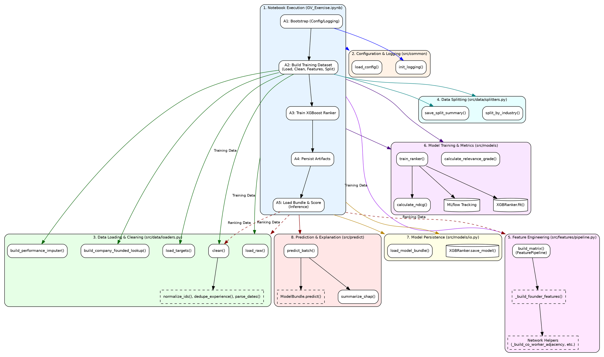

```dot
digraph ExecutionFlow {
    fontname="Helvetica"
    fontsize=10
    rankdir=TB
    nodesep=0.5
    ranksep=1.2
    compound=true;

    node [shape=rect style="filled,rounded" fontname="Helvetica" fontsize=10 fillcolor=white]
    edge [fontname="Helvetica" fontsize=9]

    # Cluster 0: Notebook Execution (GV_Exercise.ipynb)
    subgraph cluster_notebook {
        label="1. Notebook Execution (GV_Exercise.ipynb)"
        style="filled,rounded"
        fillcolor="#E6F3FF"

        NB_A1 [label="A1: Bootstrap (Config/Logging)"]
        NB_A2 [label="A2: Build Training Dataset\n(Load, Clean, Features, Split)"]
        NB_A3 [label="A3: Train XGBoost Ranker"]
        NB_A4 [label="A4: Persist Artifacts"]
        NB_A5 [label="A5: Load Bundle & Score\n(Inference)"]

        NB_A1 -> NB_A2 -> NB_A3 -> NB_A4 -> NB_A5
    }

    # Cluster 1: Configuration & Logging (src/common)
    subgraph cluster_config {
        label="2. Configuration & Logging (src/common)"
        style="filled,rounded"
        fillcolor="#FFF2E6"

        C_load_config [label="load_config()"]
        C_init_logging [label="init_logging()"]
        
        # Internal details hidden for clarity
    }

    # Cluster 2: Data Loading & Cleaning (src/data/loaders.py)
    subgraph cluster_data_loading {
        label="3. Data Loading & Cleaning (src/data/loaders.py)"
        style="filled,rounded"
        fillcolor="#E6FFE6"

        DL_load_raw [label="load_raw()"]
        DL_load_targets [label="load_targets()"]
        DL_clean [label="clean()"]
        DL_build_perf_imputer [label="build_performance_imputer()"]
        DL_build_founded_lookup [label="build_company_founded_lookup()"]
        
        DL_helpers [label="normalize_ids(), dedupe_experience(), parse_dates()", style=dashed]

        DL_clean -> DL_helpers
    }

    # Cluster 3: Data Splitting (src/data/splitters.py)
    subgraph cluster_data_splitting {
        label="4. Data Splitting (src/data/splitters.py)"
        style="filled,rounded"
        fillcolor="#E6FFFF"

        DS_split_by_industry [label="split_by_industry()"]
        DS_save_split_summary [label="save_split_summary()"]
    }

    # Cluster 4: Feature Engineering (src/features/pipeline.py)
    subgraph cluster_features {
        label="5. Feature Engineering (src/features/pipeline.py)"
        style="filled,rounded"
        fillcolor="#FFE6FF"

        FE_build_matrix [label="build_matrix()\n(FeaturePipeline)"]
        FE_build_founder_features [label="_build_founder_features()", style=dashed]
        FE_network_helpers [label="Network Helpers\n(_build_co_worker_adjacency, etc.)", style=dashed]

        FE_build_matrix -> FE_build_founder_features
        FE_build_founder_features -> FE_network_helpers
    }

    # Cluster 5: Model Training & Metrics (src/models)
    subgraph cluster_training {
        label="6. Model Training & Metrics (src/models)"
        style="filled,rounded"
        fillcolor="#F9E6FF"

        MT_train_ranker [label="train_ranker()"]
        MT_calculate_relevance_grade [label="calculate_relevance_grade()"]
        MT_calculate_ndcg [label="calculate_ndcg()"]
        MT_mlflow [label="MLflow Tracking", shape=cylinder]
        MT_xgb_fit [label="XGBRanker.fit()", shape=cylinder]

        MT_train_ranker -> MT_calculate_ndcg
        MT_train_ranker -> MT_mlflow
        MT_train_ranker -> MT_xgb_fit
    }

    # Cluster 6: Model Persistence (src/models/io.py)
    subgraph cluster_persistence {
        label="7. Model Persistence (src/models/io.py)"
        style="filled,rounded"
        fillcolor="#FFFFE6"

        MP_load_model_bundle [label="load_model_bundle()"]
        MP_XGB_Save [label="XGBRanker.save_model()", shape=cylinder]
    }

    # Cluster 7: Prediction & Explanation (src/predict)
    subgraph cluster_prediction {
        label="8. Prediction & Explanation (src/predict)"
        style="filled,rounded"
        fillcolor="#FFE6E6"

        P_predict_batch [label="predict_batch()"]
        P_bundle_predict [label="ModelBundle.predict()", style=dashed]
        P_summarize_shap [label="summarize_shap()"]

        P_predict_batch -> P_bundle_predict
        P_predict_batch -> P_summarize_shap
    }

    # Edges connecting Notebook to Modules

    # A1 Connections
    NB_A1 -> C_load_config [color="blue" ltail=cluster_notebook lhead=cluster_config]
    NB_A1 -> C_init_logging [color="blue"]

    # A2 Connections
    NB_A2 -> DL_load_raw [color="darkgreen" xlabel="Training Data" ltail=cluster_notebook lhead=cluster_data_loading]
    NB_A2 -> DL_build_perf_imputer [color="darkgreen"]
    NB_A2 -> DL_clean [color="darkgreen" xlabel="Training Data"]
    NB_A2 -> DL_load_targets [color="darkgreen"]
    NB_A2 -> MT_calculate_relevance_grade [color="indigo" ltail=cluster_notebook lhead=cluster_training]
    NB_A2 -> DL_build_founded_lookup [color="darkgreen"]
    NB_A2 -> FE_build_matrix [color="purple" xlabel="Training Data" ltail=cluster_notebook lhead=cluster_features]
    NB_A2 -> DS_split_by_industry [color="teal" ltail=cluster_notebook lhead=cluster_data_splitting]
    NB_A2 -> DS_save_split_summary [color="teal"]

    # A3 Connections
    NB_A3 -> MT_train_ranker [color="indigo" ltail=cluster_notebook lhead=cluster_training]

    # A4 Connections
    NB_A4 -> MP_XGB_Save [color="darkgoldenrod" ltail=cluster_notebook lhead=cluster_persistence]

    # A5 Connections
    NB_A5 -> MP_load_model_bundle [color="darkgoldenrod" ltail=cluster_notebook lhead=cluster_persistence]
    # Dashed lines indicate reuse of functions for inference data
    NB_A5 -> DL_load_raw [color="darkred" xlabel="Ranking Data" style=dashed ltail=cluster_notebook lhead=cluster_data_loading]
    NB_A5 -> DL_clean [color="darkred" xlabel="Ranking Data" style=dashed]
    NB_A5 -> FE_build_matrix [color="darkred" xlabel="Ranking Data" style=dashed ltail=cluster_notebook lhead=cluster_features]
    NB_A5 -> P_predict_batch [color="darkred" ltail=cluster_notebook lhead=cluster_prediction]
}
```